# Thumblify – AI Thumbnail Generator

Thumblify is an AI-powered web application that helps users generate high-quality thumbnails for videos instantly.  
It removes the need for manual design by using AI image generation and modern UI tools.

Users can generate thumbnails quickly and download them directly from the dashboard.

---

# Features

- AI-powered thumbnail generation
- Modern SaaS landing page
- User authentication system
- Thumbnail history dashboard
- Download generated thumbnails
- Cloud image storage
- Responsive UI
- 5 free thumbnail generations per user

---

# Tech Stack

### Frontend
- React
- TypeScript
- TailwindCSS
- Framer Motion
- React Router

### Backend
- Node.js
- Express
- MongoDB
- Mongoose

### AI & Media
- OpenAI Image Generation API
- Cloudinary Image Storage

---

# Screenshots

## Landing Page
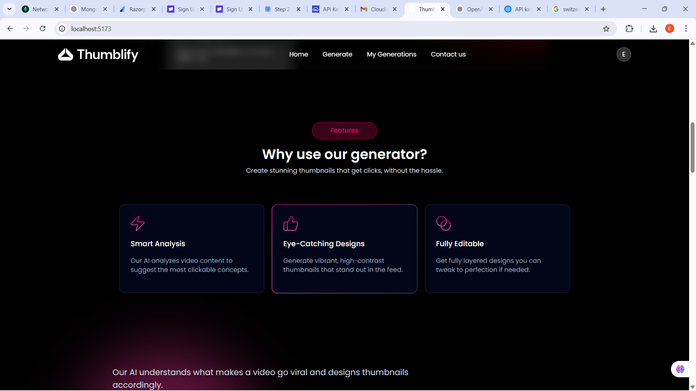

---

## Sign Up Page
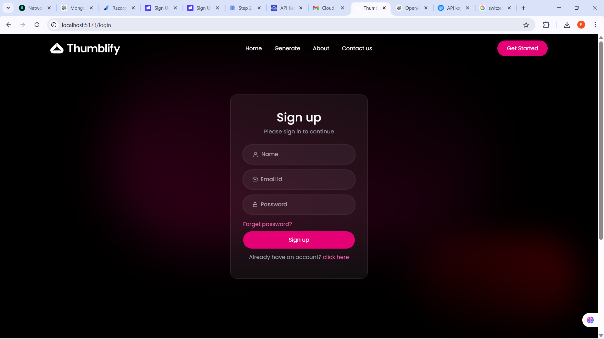

---

## Login Page
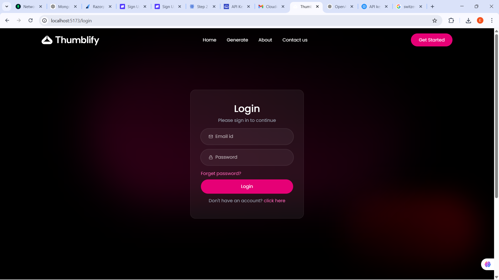

---

## Homepage After Login


---

## Thumbnail Generator
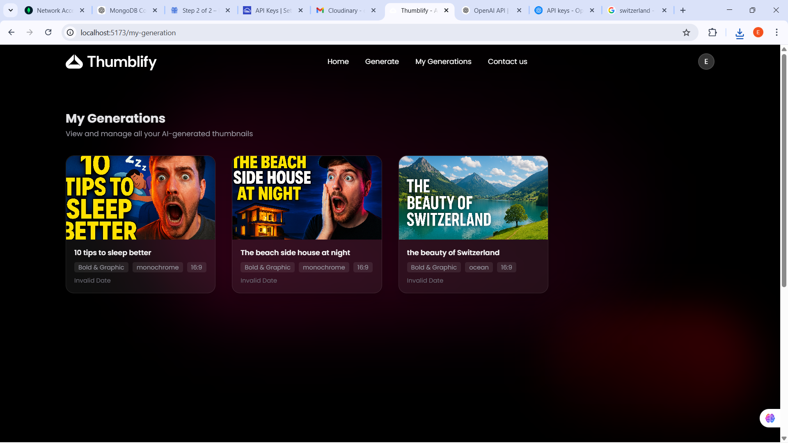

---

## Generating Thumbnail
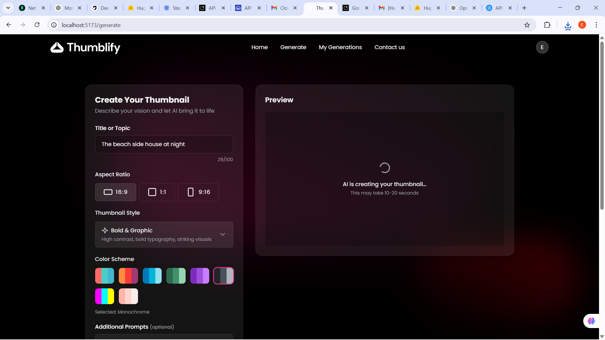

---

## Generated Result
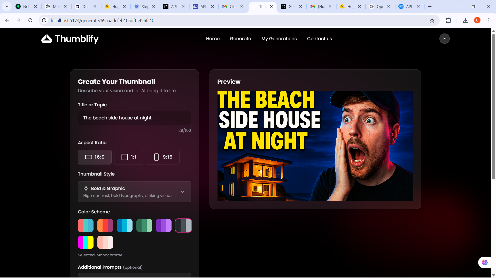

---

## Open Generated Image


---

## Download Thumbnail
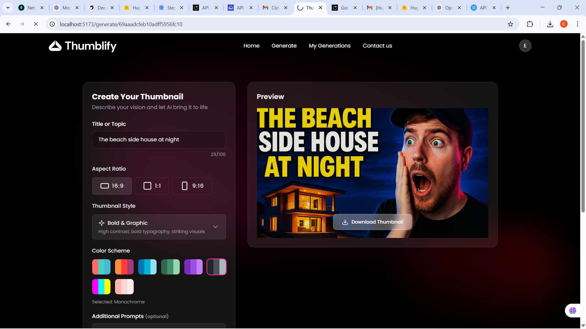

---

## Pricing Plan
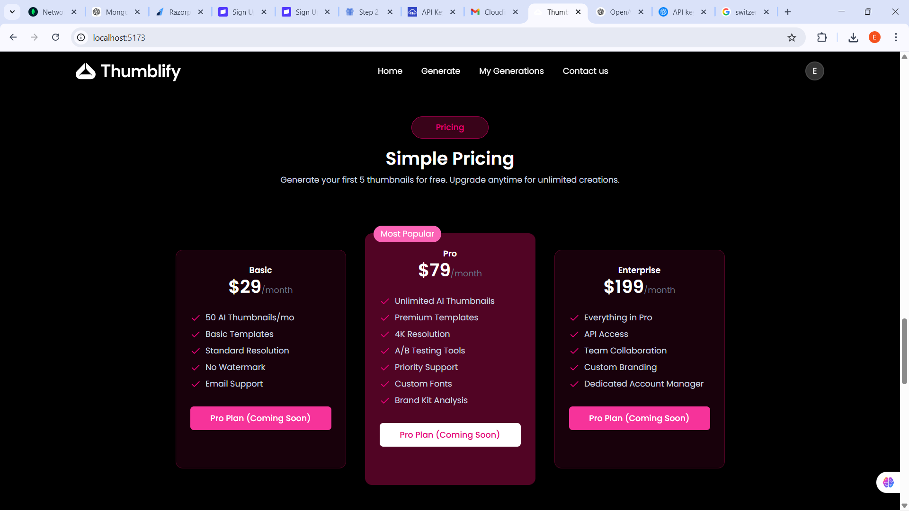

---

## Testimonials Section
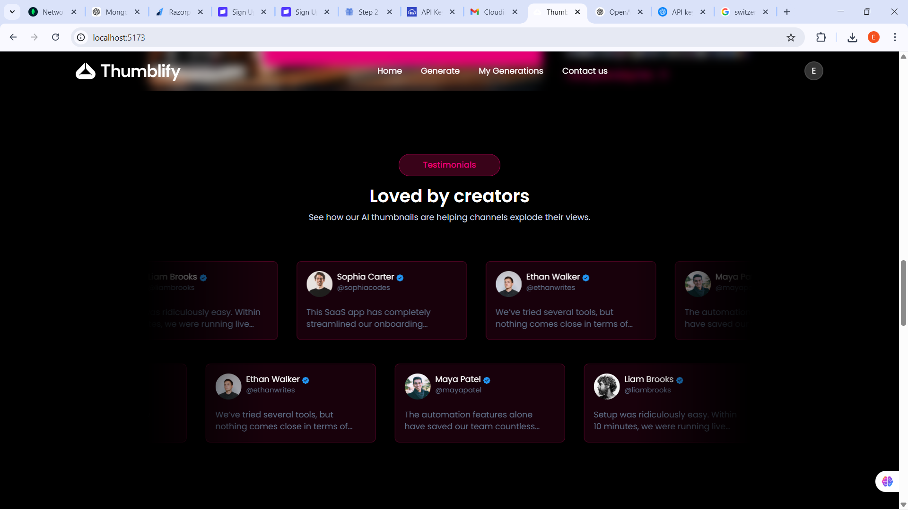

---

## Contact Section
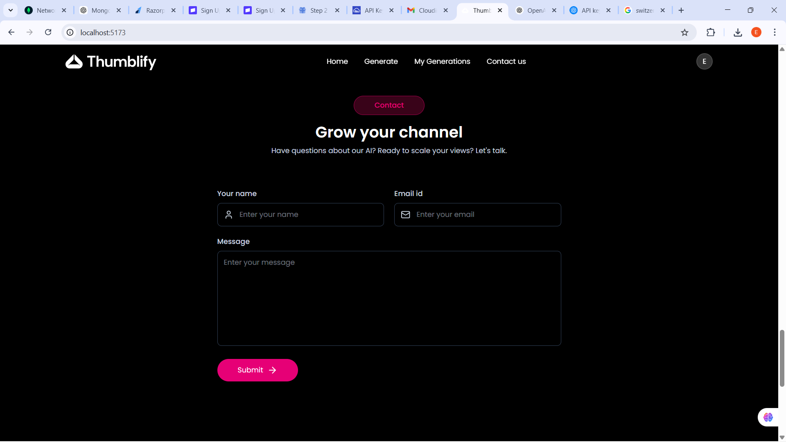

---

## Footer
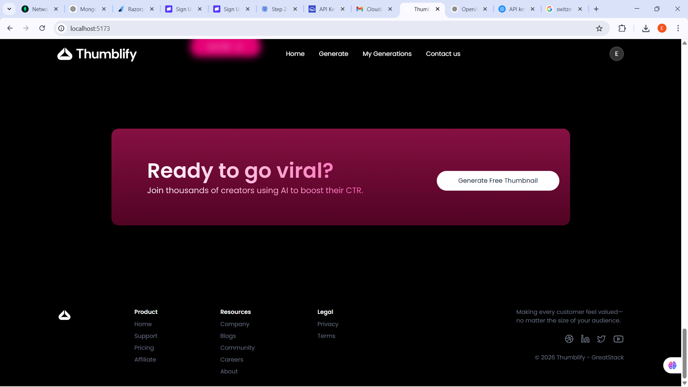

---

# Installation

Clone the repository

```bash
git clone https://github.com/yourusername/thumblify.git

Go into the project directory

cd thumblify
Backend Setup
cd server
npm install

Create a .env file

MONGO_URI=your_mongodb_url
OPENAI_API_KEY=your_openai_key
CLOUDINARY_CLOUD_NAME=your_cloud_name
CLOUDINARY_API_KEY=your_api_key
CLOUDINARY_API_SECRET=your_api_secret

Start backend

npm run dev
Frontend Setup
cd client
npm install
npm run dev
Future Improvements

Stripe or Razorpay subscription plans

Unlimited thumbnail generation for Pro users

Thumbnail editing tools

Prompt history

AI style presets

Author

Esh

License

This project is for learning and portfolio purposes.